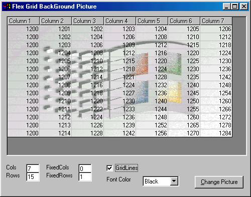



## Grid Background Picture for FlexGrid Control

### Description

Ever wanted to see a picture behind flexgrid text (not a single cellpicture!)?

This project is a little part of my custom grid control. Picture idea was given by a questioner Experts-Exchange site.

Please let me know your ideas and let me know if you want to have a more flexible FlexGrid control code.

Enjoy.

Suat Ozgur
 
### More Info
 

             |
---                |---
**Submitted On**   |2001-09-18 14:25:36
**By**             |[smozgur](https://github.com/Planet-Source-Code/PSCIndex/blob/master/ByAuthor/smozgur.md)
**Level**          |Intermediate
**User Rating**    |4.6 (41 globes from 9 users)
**Compatibility**  |VB 5\.0, VB 6\.0
**Category**       |[Custom Controls/ Forms/  Menus](https://github.com/Planet-Source-Code/PSCIndex/blob/master/ByCategory/custom-controls-forms-menus__1-4.md)
**World**          |[Visual Basic](https://github.com/Planet-Source-Code/PSCIndex/blob/master/ByWorld/visual-basic.md)
**Archive File**   |[Background266089182001\.zip](https://github.com/Planet-Source-Code/smozgur-grid-background-picture-for-flexgrid-control__1-27340/archive/master.zip)

